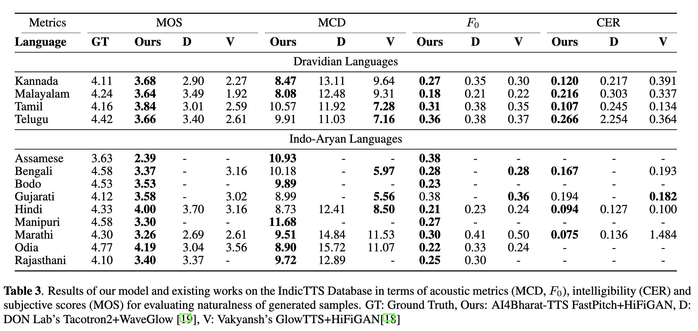

# Towards Building Text-To-Speech Systems for the Next Billion Users

Deep learning based text-to-speech (TTS) systems have been evolving rapidly with advances in model architectures, training methodologies, and generalization across speakers and languages. However, these advances have not been thoroughly investigated for Indian language speech synthesis. Such investigation is computationally expensive given the number and diversity of Indian languages, relatively lower resource availability, and the diverse set of advances in neural TTS that remain untested.  In this paper, we evaluate the choice of acoustic models, vocoders, supplementary loss functions, training schedules, and speaker and language diversity for Dravidian and Indo-Aryan languages. Based on this, we identify monolingual models with FastPitch and HiFi-GAN V1, trained jointly on male and female speakers to perform the best. With this setup, we train and evaluate TTS models for 13 languages and find our models to significantly improve upon existing models in all languages as measured by mean opinion scores. We open-source all models on the [Bhashini platform](https://bhashini.gov.in/ulca/model/explore-models).

**TL;DR:** We open-source SOTA Text-To-Speech models for 13 Indian languages: *Assamese, Bengali, Bodo, Gujarati, Hindi, Kannada, Malayalam, Manipuri, Marathi, Odia, Rajasthani, Tamil and Telugu*. Check out our audio samples [here.](https://models.ai4bharat.org/#/tts/samples)

**Authors:** Gokul Karthik Kumar*, Praveen S V*, Pratyush Kumar, Mitesh M. Khapra, Karthik Nandakumar

**[[ArXiv Preprint (TBD)](#)]**

## Unified architecture of our TTS system


## Results


## Setup:
### Environment Setup:
```
# 1. Create environment
sudo apt-get install libsndfile1-dev
conda create -n tts-env
conda activate tts-env

# 2. Setup PyTorch
pip3 install -U torch torchvision torchaudio --extra-index-url https://download.pytorch.org/whl/cu113

# 3. Setup Trainer
git clone https://github.com/gokulkarthik/Trainer 

cd Trainer
pip3 install -e .[all]
cd ..
[or]
cp Trainer/trainer/logging/wandb_logger.py to the local Trainer installation # fixed wandb logger
cp Trainer/trainer/trainer.py to the local Trainer installation # fixed model.module.test_log and added code to log epoch 
add `gpus = [str(gpu) for gpu in gpus]` in line 53 of trainer/distribute.py

# 4. Setup TTS
git clone https://github.com/gokulkarthik/TTS 

cd TTS
pip3 install -e .[all]
cd ..
[or]
cp TTS/TTS/bin/synthesize.py to the local TTS installation # added multiple output support for TTS.bin.synthesis

# 5. Install other requirements
> pip3 install -r requirements.txt
```


### Data Setup:
1. Format IndicTTS dataset in LJSpeech format using [preprocessing/FormatDatasets.ipynb](./preprocessing/FormatDatasets.ipynb)
2. Analyze IndicTTS dataset to check TTS suitability using [preprocessing/AnalyzeDataset.ipynb](./preprocessing/AnalyzeDataset.ipynb)

### Running Steps:
1. Set the configuration with [main.py](./main.py), [vocoder.py](./vocoder.py), [configs](./configs) and [run.sh](./run.sh). Make sure to update the CUDA_VISIBLE_DEVICES in all these files.
2. Train and test by executing `sh run.sh`

Code Reference: [https://github.com/coqui-ai/TTS](https://github.com/coqui-ai/TTS)
